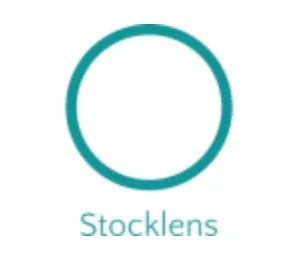

# 📈 StockLens

A beginner-friendly stock analysis dashboard that lets anyone analyze stock price movements, volatility, and risk — no finance degree needed.

**[🚀 Try the live app here](https://stocklens.streamlit.app)**

---

## What does it do?

StockLens pulls real stock data from Yahoo Finance and displays it in a clean, easy-to-understand dashboard. You can:

- 🔍 Search any stock by company name or ticker symbol
- 📊 See the stock's price history as a line or candlestick chart
- 📉 Analyze how risky the stock has been lately (volatility)
- 💰 View key stats like latest price, market cap, and analyst rating
- 🗞 Read the latest news headlines for the stock
- 📥 Download the data as a CSV file for further analysis
- 🌏 Supports global stocks including Indonesian stocks (IDX)

---

## Preview



---

## How to use it

**1. Search for a stock**
Type a company name (e.g. `Apple`, `Tesla`, `Bank Central Asia`) or a ticker symbol (e.g. `AAPL`, `TSLA`, `BBCA.JK`) in the search bar on the left sidebar.

**2. Select the company**
A dropdown will appear with matching results. Pick the one you're looking for.

**3. Set the date range**
Choose a start and end date to define the time period you want to analyze. The default is the last 2 years.

**4. Choose a volatility window**
Select 30, 60, or 90 days. This controls how many days are used to calculate rolling volatility.
- **30 days** → reacts quickly to recent changes
- **90 days** → smoother, longer-term view

**5. Read the results**
- **Latest Price** — the most recent closing price
- **Daily Return** — how much the price changed today
- **Current Volatility** — how wildly the stock has been moving (🟢 Low / 🟡 Moderate / 🔴 High)
- **52-Week High / Low** — the highest and lowest price over the selected period
- **Analyst Rating** — what Wall Street analysts think (Buy / Neutral / Don't Buy)

**6. Explore the charts**
- **Price chart** — toggle between Line and Candlestick view
- **Volatility chart** — see how risk has changed over time
- **Volume chart** — see how much trading activity there was each day

**7. Compare two stocks**
Type a second stock in the comparison box to overlay its volatility on the same chart.

**8. Read the news**
Scroll down (or check the sidebar) for the latest headlines about the stock.

---

## For Indonesian stocks 🇮🇩

Add `.JK` after the ticker symbol to search Indonesian stocks listed on the IDX:

| Company | Ticker |
|---|---|
| Bank Central Asia | `BBCA.JK` |
| Telkom Indonesia | `TLKM.JK` |
| Bank Rakyat Indonesia | `BBRI.JK` |
| Astra International | `ASII.JK` |
| GoTo | `GOTO.JK` |

---

## Understanding volatility

| Volatility | What it means |
|---|---|
| Below 20% 🟢 | Calm and stable stock |
| 20% – 40% 🟡 | Moderate movement |
| Above 40% 🔴 | High risk, very unpredictable |

---

## Run it locally

**1. Clone the repository**
```bash
git clone https://github.com/HansFilbert13/stocklens-dashboard.git
cd stocklens-dashboard
```

**2. Install dependencies**
```bash
pip install -r requirements.txt
```

**3. Run the app**
```bash
streamlit run main.py
```

**4. Open in browser**
The app will automatically open at `http://localhost:8501`

---

## Tech stack

| Tool | Purpose |
|---|---|
| Python | Core language |
| Streamlit | Web app framework |
| yfinance | Stock data from Yahoo Finance |
| Plotly | Interactive charts |
| Pandas | Data processing |

---

## Disclaimer

This app is built for **educational purposes only**. The analyst ratings and data shown are sourced from Yahoo Finance and should not be taken as financial advice. Always do your own research before making any investment decisions.

---

Built by **Hans Filbert** — Year 2 Data Science & AI Student
